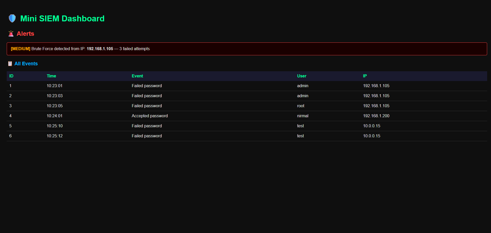

# 🛡️ Mini SIEM Dashboard

A Python-based Security Information and Event Management (SIEM) tool that parses authentication logs, detects brute force attacks, stores events in a database, and displays everything in a web dashboard.

## 🔧 Features
- Log parsing using Regex
- Brute force attack detection (rule-based)
- SQLite database storage
- Flask web dashboard with dark theme

## 🚀 How to Run

1. Clone the repo:
   git clone https://github.com/NirmalSanjyal/mini-siem.git

2. Install dependencies:
   pip install flask

3. Parse logs and populate database:
   python parser.py

4. Run the dashboard:
   python app.py

5. Open browser and go to:
   http://127.0.0.1:5000

## 🛠️ Tech Stack
- Python
- Flask
- SQLite
- HTML/CSS

## 📸 Dashboard Preview

## 👨‍💻 Author
Nirmal Sanjyal — Cybersecurity Student | ISMT College, Kathmandu